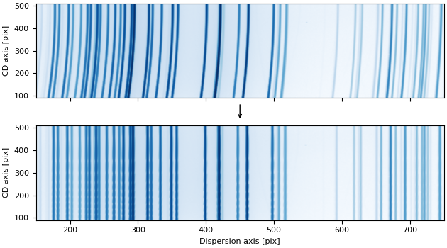

.. _tilt_correction:

2D Tilt Correction
==================

Tilt correction is a calibration step that addresses optical
distortions and misalignments in spectroscopic instruments. These distortions cause wavelength
to vary along the cross-dispersion (spatial) axis, resulting in spectral features appearing
tilted or curved across the detector rather than being perfectly aligned with detector columns.

Tilt correction is performed by modeling a two-dimensional tilt function that describes how
wavelength positions shift across the spatial axis. This function can be determined empirically
from arc lamp calibration spectra by measuring how the centroids of emission lines vary along
the cross-dispersion axis.

Once characterized, the tilt function enables transformation of two-dimensional spectroscopic
images so that wavelengths become aligned along straight lines parallel to the detector axes.
This alignment is important for achieving accurate wavelength calibration and performing robust
sky subtraction.

The ``specreduce`` library provides two complementary classes for 2D tilt correction:

- :class:`~specreduce.tilt_correction.TiltCorrection`: a high-level calibration workflow
  to detect arc lines across the detector, fit a 2D polynomial tilt model, and inspect the
  results.
- :class:`~specreduce.tilt_solution.TiltSolution`: a lightweight solution container that
  holds the tilt-corrected-to-detector coordinate transform and provides flux-conserving 2D
  resampling.

The tilt function is represented as a 2D polynomial using an
:class:`~astropy.modeling.polynomial.Polynomial2D` instance. A typical workflow involves:

1. **Initialization**: Create an instance with arc lamp data, a trace, or a reference pixel
   position.
2. **Line Detection**: Identify emission lines across the detector.
3. **Fitting**: Fit a 2D polynomial model to characterize the geometric distortion.
4. **Inspection**: Assess fit quality using diagnostic plots.
5. **Applying the Solution**: Use the fitted solution to tilt-correct observed frames.

Quickstart
----------

1. Initialization
*****************

You instantiate :class:`~specreduce.tilt_correction.TiltCorrection` by providing one or more arc
lamp calibration frames and a :class:`~specreduce.tracing.Trace` object.
The trace automatically sets the reference positions used to center the tilt model:

.. code-block:: python

    from specreduce.tilt_correction import TiltCorrection

    tc = TiltCorrection(arc_frames=arc, trace=trace)

Alternatively, you can specify the reference positions manually without a trace:

.. code-block:: python

    tc = TiltCorrection(arc_frames=arc, cdisp_ref_pixel=512)

Key parameters:

*   **arc_frames**: One or more arc lamp frames as `~astropy.nddata.NDData` instances (or a
    sequence of them). Multiple arc frames are supported for combining different lamps.

*   **trace**: A :class:`~specreduce.tracing.Trace` object representing the spectrum trace.
    When provided, the reference pixel is derived automatically.

*   **cdisp_ref_pixel**: The reference pixel position along the cross-dispersion axis.
    Should be close to the trace's average cross-dispersion position for best results.
    Determined automatically if a ``trace`` is provided.

*   **disp_ref_pixel**: The reference pixel position along the dispersion axis. Defaults
    to the center of the frame if not provided. Determined automatically if a ``trace``
    is provided.

*   **n_cdisp_samples**: Number of cross-dispersion sample positions to generate (default 10).
    Arc lines are measured at each sample position to characterize how line centroids shift
    across the spatial axis.

*   **cdisp_sample_lims**: Tuple ``(min, max)`` specifying the range for cross-dispersion
    sampling. Defaults to the full extent of the frame.

*   **cdisp_samples**: An explicit list of cross-dispersion positions to use instead of
    automatically generated ones. Overrides ``n_cdisp_samples`` if provided.

*   **mask_treatment**: Controls how masked or non-finite values are handled in the input
    image. Accepts any of the standard ``specreduce`` masking options (``"apply"``,
    ``"ignore"``, ``"propagate"``, ``"zero_fill"``, ``"nan_fill"``,
    ``"apply_mask_only"``, ``"apply_nan_only"``).

2. Finding Arc Lines
********************

After initialization, detect emission lines at the reference row and at each cross-dispersion
sample position using
:meth:`~specreduce.tilt_correction.TiltCorrection.find_arc_lines`:

.. code-block:: python

    tc.find_arc_lines(fwhm=3.5, noise_factor=5)

This method:

1. Identifies line centroids at the **reference row** (set by ``cdisp_ref_pixel``) —
   these define the "ideal" line positions.
2. Identifies line centroids at each **cross-dispersion sample** position.
3. Builds KD-trees from the sample positions for efficient nearest-neighbor matching
   during the fitting step.

Parameters:

*   **fwhm**: Expected full width at half maximum of the spectral lines (in pixels), used by
    the line-finding algorithm.
*   **noise_factor**: Multiplier for noise thresholding — lines below
    ``noise_factor × noise_level`` are rejected. Default is 5.

3. Fitting the Tilt Model
*************************

Fit a 2D polynomial model that maps coordinates from the tilt-corrected space to
detector space using :meth:`~specreduce.tilt_correction.TiltCorrection.fit`:

.. code-block:: python

    tc.fit(degree=4, max_distance=10)

The fitting proceeds in two stages:

1. **Initial optimization**: Uses `scipy.optimize.minimize` to
   minimize the sum of distances between the transformed sample positions and their nearest
   neighbors in detector space (via the KD-trees).
2. **Least-squares refinement**: Automatically calls
   :meth:`~specreduce.tilt_correction.TiltCorrection.refine_fit` to perform a
   least-squares fit on matched line pairs, using the initial solution as the starting point.

Parameters:

*   **degree**: Degree of the final :class:`~astropy.modeling.polynomial.Polynomial2D` model.
*   **method**: Optimization method for the initial stage (default ``"Powell"``).
*   **max_distance**: Maximum distance for nearest-neighbor matching during the initial fit.

After the initial fit, you can further refine the solution with tighter matching constraints:

.. code-block:: python

    tc.refine_fit(degree=4, match_distance_bound=3.0)

This is useful for iteratively tightening the match distance to reject outliers and
improve the polynomial fit.

4. Inspecting the Fit
*********************

Several diagnostic tools help assess the quality of the tilt solution:

*   **Residual visualization**: Use
    :meth:`~specreduce.tilt_correction.TiltCorrection.plot_fit_quality` to see a 2D scatter
    of matched lines with 1D residual projections along both axes:

    .. code-block:: python

        fig = tc.plot_fit_quality(max_match_distance=5)

*   **Wavelength contours**: Use
    :meth:`~specreduce.tilt_correction.TiltCorrection.plot_wavelength_contours` to overlay
    constant-wavelength contour lines on a detector image, verifying that the tilt model
    aligns with the arc features:

    .. code-block:: python

        import matplotlib.pyplot as plt

        fig, ax = plt.subplots()
        ax.imshow(arc.data, origin="lower", aspect="auto")
        tc.plot_wavelength_contours(ax=ax, n_disp=50)

5. Using the Tilt Solution
**************************

The fitted solution is stored as a :class:`~specreduce.tilt_solution.TiltSolution` instance
in ``TiltCorrection.solution``. The solution object provides the coordinate transform and
flux-conserving resampling independently of the calibration workflow.

*   **Coordinate transform**: Use
    :meth:`~specreduce.tilt_solution.TiltSolution.corr_to_det` to convert coordinates from
    the tilt-corrected space to detector space:

    .. code-block:: python

        ts = tc.solution
        det_x, det_y = ts.corr_to_det(disp=500, cdisp=300)

*   **Underlying model**: The compound Astropy model is accessible via the
    :attr:`~specreduce.tilt_solution.TiltSolution.c2d` property:

    .. code-block:: python

        print(ts.c2d)

*   **GWCS object**: Access the `~gwcs.wcs.WCS` object via the
    :attr:`~specreduce.tilt_solution.TiltSolution.gwcs` property. This represents
    the full 2D-tilt-corrected-to-detector coordinate mapping:

    .. code-block:: python

        wcs = ts.gwcs
        det_x, det_y = wcs(disp_corr, cdisp)

*   **Inverse coordinate transform**: Use
    :meth:`~specreduce.tilt_solution.TiltSolution.det_to_corr` to convert coordinates from
    detector space back to the tilt-corrected space:

    .. code-block:: python

        corr_x, corr_y = ts.det_to_corr(disp=500, cdisp=300)

    The inverse model is accessible via the
    :attr:`~specreduce.tilt_solution.TiltSolution.d2c` property:

    .. code-block:: python

        print(ts.d2c)

*   **Reconstructing from GWCS**: Use
    :meth:`~specreduce.tilt_solution.TiltSolution.from_gwcs` to reconstruct a
    ``TiltSolution`` from a previously exported GWCS object:

    .. code-block:: python

        from specreduce.tilt_solution import TiltSolution

        ts_restored = TiltSolution.from_gwcs(wcs, image_shape=(ny, nx))

*   **Flux-conserving resampling**: Use
    :meth:`~specreduce.tilt_solution.TiltSolution.resample` to tilt-correct a 2D spectral
    image. The resampling is exact and conserves flux as long as the tilt-corrected space
    covers the full detector extent:

    .. code-block:: python

        corrected = ts.resample(science_frame)

    You can control the output grid:

    .. code-block:: python

        # Custom number of bins
        corrected = ts.resample(science_frame, nbins=1000)

        # Custom bounds
        corrected = ts.resample(science_frame, bounds=(100, 900))

        # Explicit bin edges
        corrected = ts.resample(science_frame, bin_edges=np.linspace(50, 950, 501))

    The ``resample`` method accepts a ``mask_treatment`` parameter with the same options as
    the :class:`~specreduce.tilt_correction.TiltCorrection` constructor.
